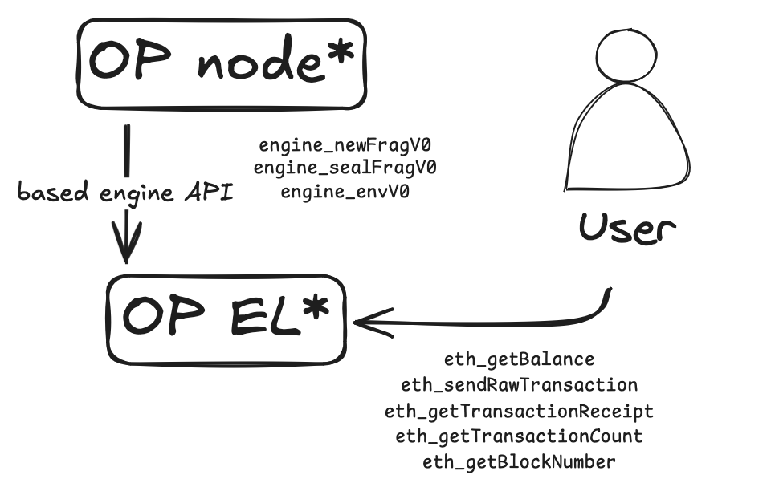

# Execution

The OP geth was upgraded to receive `Frag`s messages from the OP node, as well as to serve state for RPC calls off the "unsealed block". Because `Frag`s are shared continously from the gateway, the EL can already start pre-processing and preparing for the block seal and sync.




## Unsealed Block

We define a new structure, `UnsealedBlock` that represents a block being reconstructed locally from `Frag`s.

```go
type UnsealedBlock struct {
    Env                *Env
    Frags              []Frag
    LastSequenceNumber *uint64
    Hash               common.Hash

    Receipts Receipts
}
```

### Starting a new unsealed block

After an `engine_envV0` call is received, the EL initializes a new unsealed blocks and prepares the block environment for frags to be applied.
For the message to be valid, the following conditions must be met:
- There must not be a an unsealed block in progress.
- The timestamp must be greater than the previous block's timestamp.
- The block number must be the next one in the sequence.
- The parent hash must match the previous block's hash.

After validation, the unsealed block is persisted in the global state via `SetCurrentUnsealedBlock`.

### Inserting frags

Upon receiving `engine_newFragV0` calls, the EL validates the received frag:

- The block number must match the current unsealed block number and there must be an opened unsealed block.
- The sequence number must be the next one in the sequence (the current unsealed block persists this number). This has several cases:
    - Before checking the sequence number is the correct one, we must make sure that the current unsealed block's last frags was not the final one (meaning this block is treated as sealed).
    - If the sequence number is 0 and the unsealed block did not received the last frag, then the frag is the first one and the current unsealed block must have the `LastSequenceNumber` set to nil.
    - If the sequence number is > 0 and the unsealed block did not received the last frag, then the frag should be the next in the sequence.


If valid, the frags are added to the unsealed block. This means executing every transaction in the frag and adding the receipts to the unsealed block.

If the frag is marked as last, the node starts sealing the block and computing the state root.

### Seal verification

With the `engine_sealFragV0` call, the node verifies that the sealed block matches with what the gateway computed. If the verification is successful, the node sets the block as canonical and advances the chain. 


