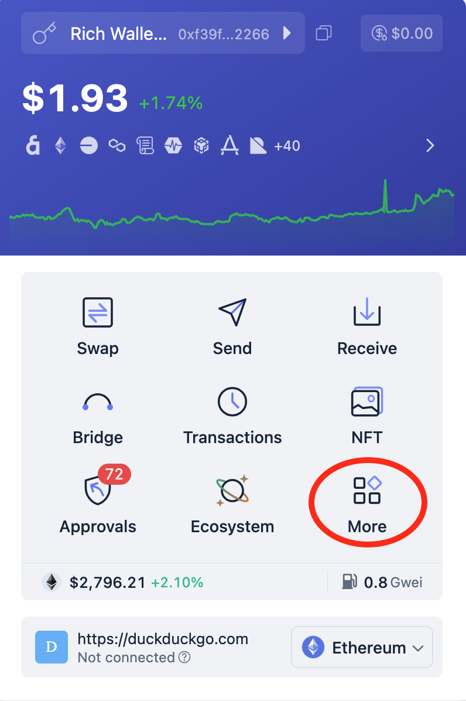
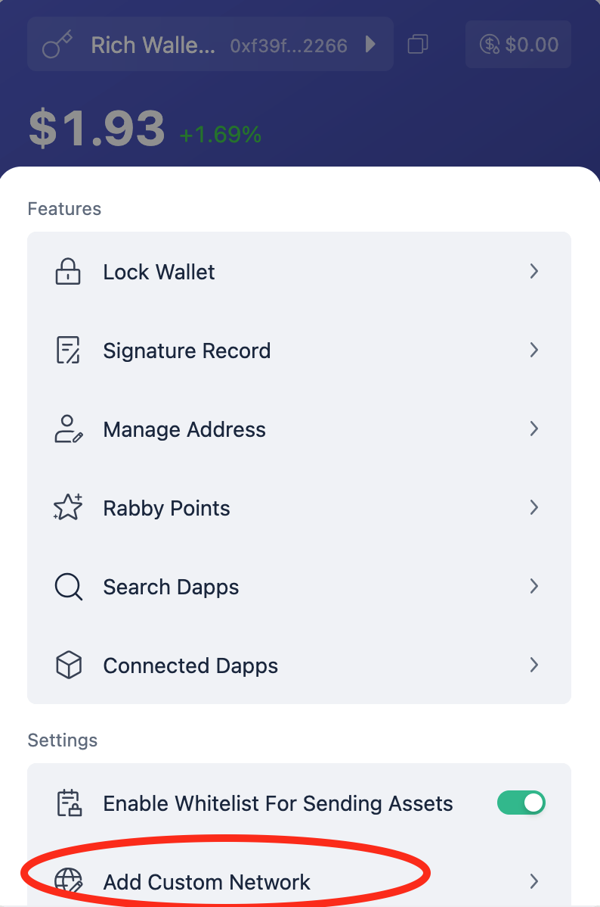
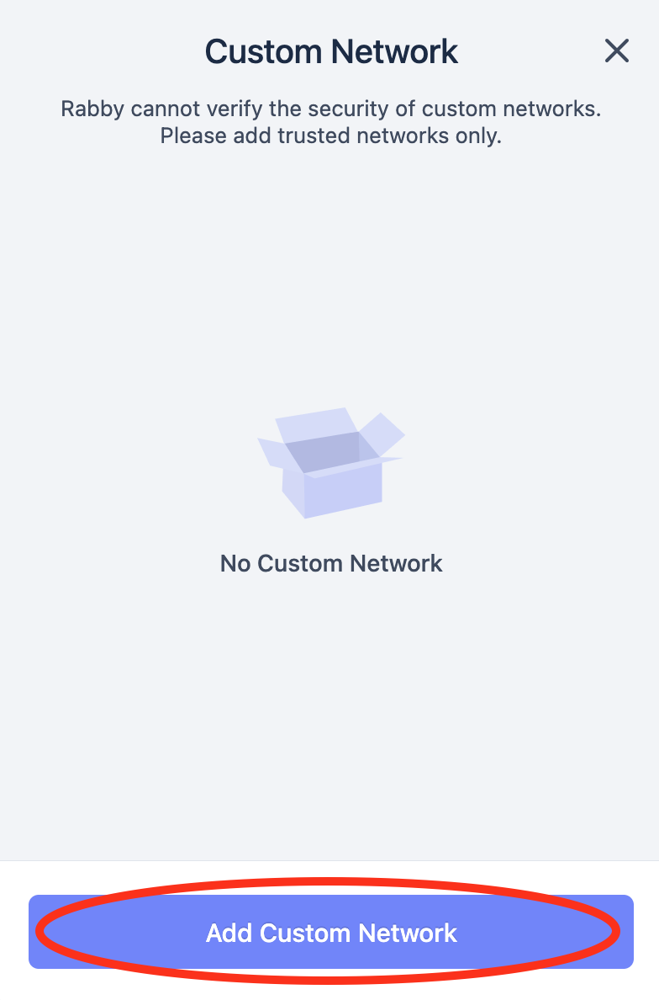
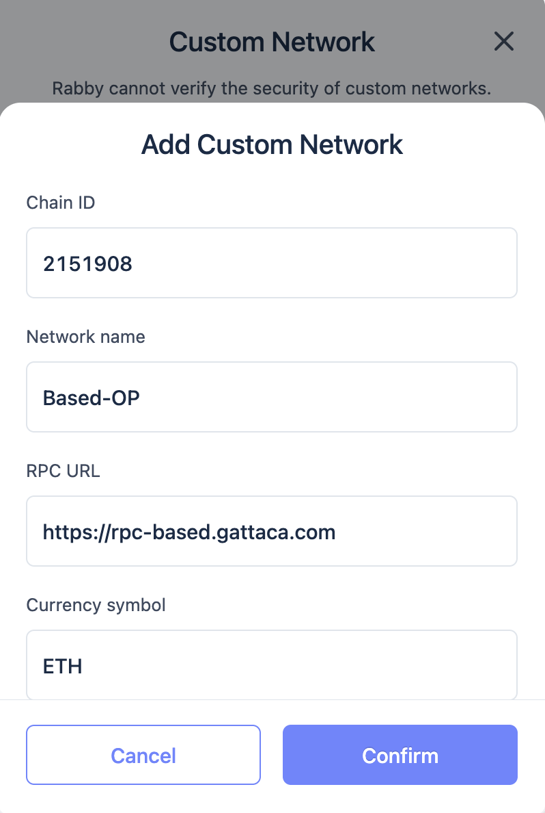
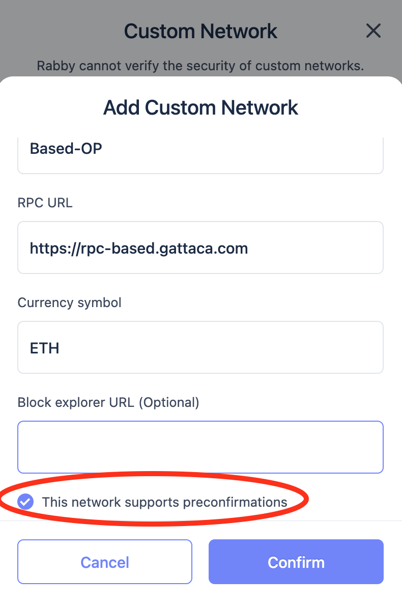
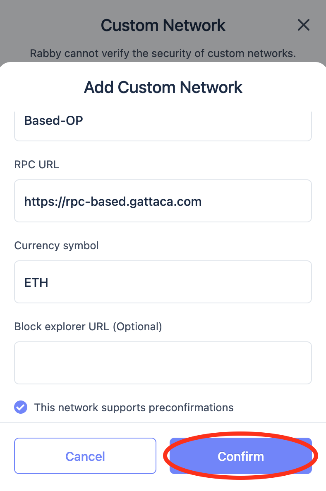

# Try out Based OP

You can try out a Based OP testnet following the steps below.

### Network Details

| Parameter | Value |
|-----------|-------|
| Chain ID | 2151908 |
| Network Name | Based-OP |
| RPC URL | https://rpc-based.gattaca.com |
| Currency Symbol | ETH |
| Block Explorer | https://explorer-based.gattaca.com/ |

To receive funds, send your address to the [faucet](https://t.me/basedoptestnet_bot). 

## Connecting a Wallet

Wallets commonly use a high polling interval for the transaction receipt. To be able to see the preconfirmation speed, we've modified Rabby to speed up that interval.

### Build and Install Modified Rabby Wallet

You can test it by compiling it:

```sh
make build-rabby
```

And importing it to your browser locally (see [Firefox](https://extensionworkshop.com/documentation/develop/temporary-installation-in-firefox/) or [Chrome](https://developer.chrome.com/docs/extensions/get-started/tutorial/hello-world#load-unpacked) references). The compiled extension directory is `rabby/dist` for Google Chrome, and `rabby/dist-mv2` for Mozilla Firefox.

### Adding the devnet as a Rabby custom network

To access our devnet, you will need to add the network to your modified wallet.

To manually add the network, follow these steps:

1. Log into your Rabby wallet, click on the **More** button near the bottom right corner.



2. Click on the **Add Custom Network** below the **Settings** section.



3. Click in **Add Custom Network**



4. Fill in the form with the following values:
    - Chain ID: `2151908`
    - Network Name: `Based-OP`
    - RPC URL: `https://rpc-based.gattaca.com`
    - Currency Symbol: `ETH`
    - Block Explorer URL: `https://explorer-based.gattaca.com/`



5. Toggle the **This network supports preconfirmations** option.



6. Click on **Confirm**.



You can now use the wallet to interact with the Based-OP devnet.

## Start a Follower Node

You can start a follower node and connect via p2p to receive frags published by the gateway.
Everything required is in the [follower-node](https://github.com/gattaca-com/based-op/blob/main/follower-node/.env) directory.

After cloning the repository:

1. Fill the `.env` file with the correct `SELF_HOSTNAME`. This is your public IP that peers will see.
2. Run `make run-follower` to start the follower node.
3. The node will start syncing and may take a while before it catches up with the tip of the chain.
4. After it's synced you should see it receiving frags via p2p eg:
```
op-node-1  | t=2025-02-25T18:33:14+0000 lvl=info msg="Received new fragment" frag="&{Signature:0xd9ef656efc8d5edd9254509f83d4998bcc3e40e836ba933d6ba0220cea3c1ff10fa85ea0311235400cb5f15f6619daec7ea1adfde0df7c79abe94d5231a359041c Frag:{BlockNumber:33528 Seq:0 IsLast:false Txs:[[126 248 248 160 125 130 181 104 88 150 80 222 45 198 152 126 100 54 255 128 30 64 116 53 62 159 99 108 143 236 136 121 117 238 171 99 148 222 173 222 173 222 173 222 173 222 173 222 173 222 173 222 173 222 173 0 1 148 66 0 0 0 0 0 0 0 0 0 0 0 0 0 0 0 0 0 0 21 128 128 131 15 66 64 128 184 164 68 10 94 32 0 0 5 88 0 12 95 197 0 0 0 0 0 0 0 2 0 0 0 0 103 190 12 212 0 0 0 0 0 0 43 174 0 0 0 0 0 0 0 0 0 0 0 0 0 0 0 0 0 0 0 0 0 0 0 0 0 0 0 0 0 0 0 7 0 0 0 0 0 0 0 0 0 0 0 0 0 0 0 0 0 0 0 0 0 0 0 0 0 0 0 0 0 0 0 1 66 82 255 250 107 194 28 121 143 145 28 192 194 12 29 16 106 207 42 191 183 16 23 188 205 96 11 81 143 226 2 152 0 0 0 0 0 0 0 0 0 0 0 0 211 242 197 175 178 215 111 85 121 243 38 176 205 125 165 245 164 18 108 53]]}}"
op-node-1  | t=2025-02-25T18:33:16+0000 lvl=info msg="Received new seal" seal="&{Signature:0x53a63fb2ef921ed70581c46035daf1e04467e70146f708ab85a8b0541597e9fc2bea4ad9095302b1b79ccba5098420f95a269311ea12aada10cabfc41af6bdf61b Seal:{TotalFrags:2 BlockNumber:33528 GasUsed:43830 GasLimit:60000000 ParentHash:0x97ed1f7195c1ff6af69e37cc7292e4ba725f124bca7cc4ba046094ad12125b20 TransactionsRoot:0x5e3f5af2c510e50d0b8ae87bf7b93a7c00af3e74b93c0982dfc1591590e6b331 ReceiptsRoot:0xd76ade467e3ff4c069369eaa3eb8810d49895272d507daa391b547de60d0e3d0 StateRoot:0xf5bdb61986462c7ab60b284dd798bcfeacd90f518de08fae6e98f309b08ffff9 BlockHash:0x42b88a5169f641a5e0d120edd4172b9e170f435e8a7dc0f738949397a31b6727}}"
op-node-1  | t=2025-02-25T18:33:16+0000 lvl=info msg="Received new env" env="&{Signature:0x595ce79312a864fa18abcfec1045a741c45053ccc084e048ccab0a2cbabfce262cf0a3c5976e306194992356e525e10219c2451695723e7fa74d1baafd80d3f31b Env:{Number:33529 Beneficiary:0x4200000000000000000000000000000000000011 Timestamp:1740508398 GasLimit:60000000 Basefee:251 Difficulty:+0 Prevrandao:0x6645169f9a75d95507766087e0a3fa33febf94374c546b3cb65256ed0d46f4ed ParentHash:0x42b88a5169f641a5e0d120edd4172b9e170f435e8a7dc0f738949397a31b6727 ParentBeaconBlockRoot:0xc73bff018f1df97b800ac189243a9c5060b03630cdd524539ce3ffcbc6e8f8af ExtraData:[0 0 0 0 250 0 0 0 6]}}"
op-node-1  | t=2025-02-25T18:33:16+0000 lvl=info msg="Received new fragment" frag="&{Signature:0xc50cde57de7111f0c24b59e1f713471d3b6f1911690f22b05f45ad753594aca13b34a9e9c8407c5ca7485c5d7a2389bc92b8a9dfac565a9da7e447f6b9723cda1c Frag:{BlockNumber:33528 Seq:1 IsLast:true Txs:[]}}"
```
5. You can now send transactions via your local node and receive preconfirmations. Note that there may be some delay due to the network latency.
6. To stop the node and clear the database, run `docker compose down -v`.